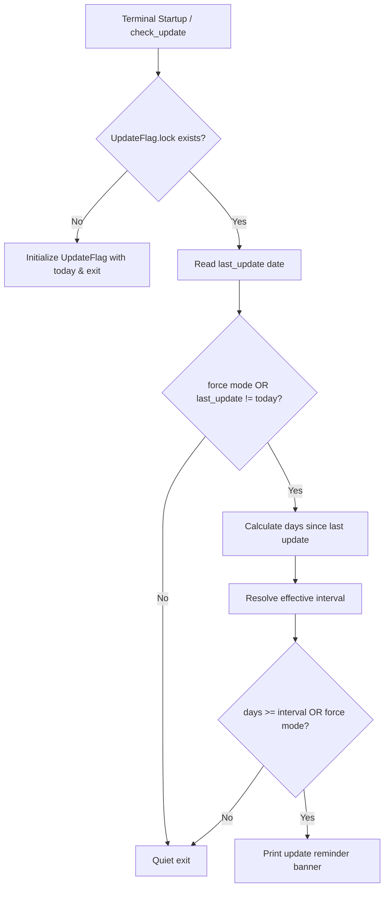

# check_update Detailed Documentation

This document explains the design goals, execution flow, configurations, status files, and maintenance guidelines for `functions/check_update.zsh`.

Scope: The startup workflow defined in `base.zsh -> core/startup_tasks.zsh -> check_update`.

---

## 1. Goals & Design Principles

`check_update` is a lightweight, non-blocking reminder that alerts the user when it has been a configured number of days (default: 1 day) or more since the last system update.

1. **Zero Latency & Non-blocking Startup**
   - Does not perform network requests or background package queries during shell startup.
   - Reads the local update timestamp flag (`~/.cache/zsh/UpdateFlag.lock`).
   - If the last update was today, exits silently immediately.

2. **Customizable Reminder Interval**
   - Allows users to customize the reminder interval threshold via CLI arguments, environment variable, or persistent configuration file.
   - Defaults to 1 day for 100% backward compatibility.

3. **No Interactive Prompt During Startup**
   - Does not block terminal input or prompt with `[Y/n/c]`.
   - Simply prints a friendly reminder message if an update is due.

4. **Separation of Concerns with `update`**
   - `check_update`: Read-only check & reminder during shell startup.
   - `update`: The dedicated command for performing system and Flatpak updates.

---

## 2. Usage & Options

- **Automatic Trigger**: Automatically called on shell startup via `core/startup_task_commands.zsh`.
- **Manual Invocation**:
  ```bash
  check_update [options] [days]
  ```

### Options & Arguments:
- `-f, --force`: Force display of the update prompt, ignoring same-day and interval limits.
- `-i, --interval <days>`: Specify reminder interval for this run (>= 1).
- `[days]` (positional): Shorthand form, equivalent to `-i <days>` (e.g. `check_update 3`).
- `-s, --set-interval <days>`: Set and persist default reminder interval to user config directory.
- `-g, --get-interval`: Display currently effective reminder interval and its source.
- `-h, --help`: Display help information and exit.

### Interval Configuration Precedence:
1. **CLI Arguments**: `-i <days>`, `--interval=<days>`, or positional `[days]`
2. **Environment Variable**: `ZFL_CHECK_UPDATE_INTERVAL` (can be configured in `usr.zsh`: `export ZFL_CHECK_UPDATE_INTERVAL=3`)
3. **User Persistent Config**: `~/.local/share/zfl/check_update_interval` (configured via `check_update -s <days>`)
4. **Framework Default**: `1` day

---

## 3. Status & Configuration Files

1. **Temporary State File** (directory: `~/.cache/zsh/`):
   - **`UpdateFlag.lock`**:
     - Contains the date of the last successful system update (`YYYY-MM-DD`).
     - Read by `check_update` to calculate elapsed days.
     - Written and updated by the `update` command upon completing system upgrades.

2. **User Persistent Config** (directory: `~/.local/share/zfl/`):
   - **`check_update_interval`**:
     - Stores user-defined default reminder interval in days (e.g. `3`).
     - Created and modified by `check_update -s <days>`.

---

## 4. Execution Flow



