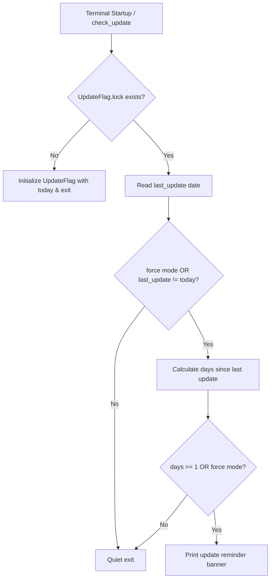

# check_update Detailed Documentation

This document explains the design goals, execution flow, configurations, and maintenance guidelines for `functions/check_update.zsh`.

Scope: The startup workflow defined in `base.zsh -> core/startup_tasks.zsh -> check_update`.

---

## 1. Goals & Design Principles

`check_update` is a lightweight, non-blocking reminder that alerts the user when it has been 1 or more days since the last system update.

1. **Zero Latency & Non-blocking Startup**
   - Does not perform network requests or background package queries during shell startup.
   - Reads the local update timestamp flag (`~/.cache/zsh/UpdateFlag.lock`).
   - If the last update was today, exits silently immediately.

2. **No Interactive Prompt During Startup**
   - Does not block terminal input or prompt with `[Y/n/c]`.
   - Simply prints a friendly reminder message if an update is due.

3. **Separation of Concerns with `update`**
   - `check_update`: Read-only daily check & reminder during shell startup.
   - `update`: The dedicated command for performing system and Flatpak updates.

---

## 2. Usage & Options

- **Automatic Trigger**: Automatically called on shell startup via `core/startup_task_commands.zsh`.
- **Manual Invocation**:
  ```bash
  check_update [options]
  ```

### Options:
- `-f, --force`: Force display of the update prompt, even if the system was updated today.
- `-h, --help`: Display help information and exit.

---

## 3. Status Files

Directory: `~/.cache/zsh/`

- **`UpdateFlag.lock`**:
  - Contains the date of the last successful system update (`YYYY-MM-DD`).
  - Read by `check_update` to determine whether at least 1 day has passed.
  - Written and updated by the `update` command upon completing system upgrades.

---

## 4. Execution Flow


