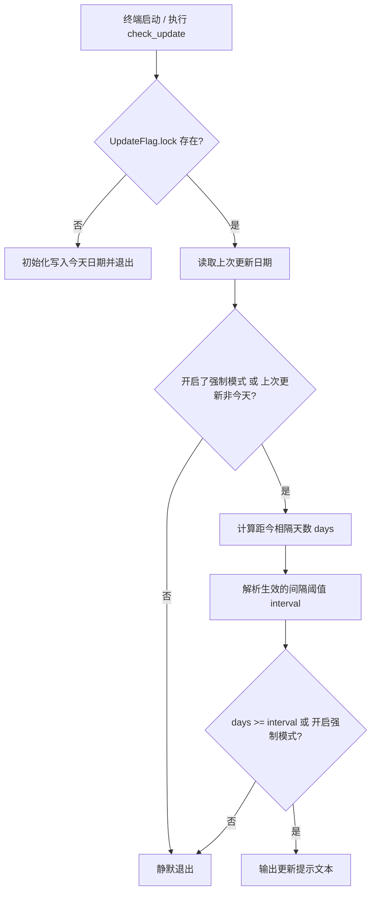

# check_update 详细文档

本文档说明 `functions/check_update.zsh` 的设计目标、执行流程、配置项、状态文件与运维说明。

适用范围：当前仓库 `base.zsh -> core/startup_tasks.zsh -> check_update` 启动链路。

---

## 1. 设计目标与原则

`check_update` 是一个极简、无阻塞的终端启动更新提示脚本，当距离上次系统更新达到或超过自定义提醒间隔（默认为 1 天）时，向终端输出一行友好提醒。

1. **零延迟与启动无卡顿**
   - 启动时不进行任何耗时的后台网络请求或包管理器只读统计。
   - 仅读取本地标记文件 `~/.cache/zsh/UpdateFlag.lock`。
   - 若当天已更新过，直接静默退出。

2. **支持自定义提醒间隔**
   - 支持通过命令行参数临时覆盖、环境变量定义或写入本地持久化配置文件。
   - 默认提醒间隔为 1 天，保证 100% 向后兼容。

3. **去除交互阻断**
   - 不弹出 `[Y/n/c]` 询问对话框，不阻塞标准输入。
   - 仅输出轻量彩色提示信息，不干扰用户立即开始使用终端。

4. **与 `update` 命令解耦**
   - `check_update`：仅负责启动时的日期检查与提示。
   - `update`：专门负责执行系统及 Flatpak 软件包更新的独立命令。

---

## 2. 入口与用法

- **自动入口**：终端启动时由 `core/startup_task_commands.zsh` 自动调用。
- **手动执行**：
  ```bash
  check_update [选项] [天数]
  ```

### 选项与参数：
- `-f, --force`：强制输出更新提示（忽略当天已更新与间隔限制）。
- `-i, --interval <天数>`：临时指定本次检查的提醒间隔天数（>= 1）。
- `[天数]` (位置参数)：简写形式，等同于 `-i <天数>`（如 `check_update 3`）。
- `-s, --set-interval <天数>`：设置并持久化保存默认提醒间隔天数（保存在用户配置目录）。
- `-g, --get-interval`：查看当前生效的提醒间隔天数及配置来源。
- `-h, --help`：显示帮助信息并退出。

### 间隔配置生效优先级：
1. **命令行参数**：`-i <天数>`、`--interval=<天数>` 或 位置参数 `[天数]`
2. **环境变量**：`ZFL_CHECK_UPDATE_INTERVAL`（可在 `usr.zsh` 中配置 `export ZFL_CHECK_UPDATE_INTERVAL=3`）
3. **用户持久化文件**：`~/.local/share/zfl/check_update_interval`（可通过 `check_update -s <天数>` 设置）
4. **框架默认值**：`1` 天

---

## 3. 状态与配置文件

1. **临时状态文件**（目录：`~/.cache/zsh/`）：
   - **`UpdateFlag.lock`**：
     - 存储上次成功更新系统的日期（格式为 `YYYY-MM-DD`）。
     - 由 `check_update` 读取以判断距今天数。
     - 由 `update` 命令在系统包更新完成时写入并刷新。

2. **用户持久化配置文件**（目录：`~/.local/share/zfl/`）：
   - **`check_update_interval`**：
     - 存储用户自定义的默认提醒间隔天数（如 `3`）。
     - 通过 `check_update -s <天数>` 生成与修改。

---

## 4. 执行流程



